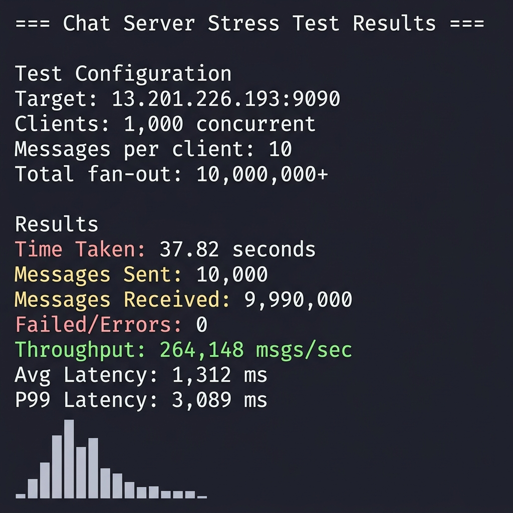

# 🚀 High-Performance TCP Chat Server

A multithreaded TCP chat server built in **C++17** using POSIX sockets, designed to handle **1,000+ concurrent clients** with broadcast and direct messaging. Deployed on **AWS EC2** behind an **Nginx TCP stream proxy** and stress-tested under real-world network conditions.

---

## ✨ Features

- **1,000+ concurrent TCP connections** with thread-per-client architecture
- **Broadcast messaging** — send to all connected users at once
- **Direct messaging** — 1:1 private messages by username
- **Custom text-based protocol** over raw TCP with newline-delimited framing
- **Correct TCP stream handling** — buffered reads with proper partial-read reassembly
- **Thread-safe shared state** using `std::shared_mutex` (reader-writer locks) and `std::atomic` counters
- **Production deployment** on AWS EC2 behind Nginx TCP (stream) reverse proxy
- **Per-IP connection limiting** enforced at the Nginx gateway layer

---

## 🏗️ Architecture

```
                    ┌──────────────┐
                    │   Clients    │
                    │  (TCP/IP)    │
                    └──────┬───────┘
                           │
                           │  TCP connections (port 8080)
                           ▼
                    ┌──────────────┐
                    │    Nginx     │
                    │  Stream Proxy│
                    │  (rate limit)│
                    └──────┬───────┘
                           │
                           │  TCP forward (localhost:9090)
                           ▼
              ┌────────────────────────┐
              │    C++ Chat Server     │
              │      (port 9090)       │
              │                        │
              │  ┌──────────────────┐  │
              │  │   Accept Loop    │  │
              │  │  (main thread)   │  │
              │  └────────┬─────────┘  │
              │           │            │
              │     ┌─────┼─────┐      │
              │     ▼     ▼     ▼      │
              │  ┌─────┬─────┬─────┐   │
              │  │ T1  │ T2  │ TN  │   │
              │  │     │     │     │   │
              │  │handle_client()  │   │
              │  └─────┴─────┴─────┘   │
              │           │            │
              │     ┌─────┴─────┐      │
              │     ▼           ▼      │
              │  ┌───────┐ ┌────────┐  │
              │  │Broadcast│ │ Route │  │
              │  │ (1:N)  │ │ (1:1) │  │
              │  └───────┘ └────────┘  │
              │                        │
              │  Shared State:         │
              │  ├─ username ↔ fd map  │
              │  ├─ shared_mutex (R/W) │
              │  └─ atomic counters    │
              └────────────────────────┘
```

### Data Flow

```
Client A                    Server                     Client B
   │                          │                           │
   │  @advertize Alice\n      │                           │
   │─────────────────────────>│   Register: Alice → fd4   │
   │                          │                           │
   │                          │      @advertize Bob\n     │
   │                          │<──────────────────────────│
   │                          │   Register: Bob → fd5     │
   │                          │                           │
   │  @Bob Hey there!\n       │                           │
   │─────────────────────────>│                           │
   │                          │   Alice->Hey there!\n     │
   │                          │──────────────────────────>│
   │                          │                           │
   │  @all Hello everyone!\n  │                           │
   │─────────────────────────>│                           │
   │                          │  Alice->Hello everyone!\n │
   │                          │──────────────────────────>│
   │                          │──────────> (all others)   │
```

---

## 📦 Project Structure

```
chat-server/
├── CMakeLists.txt          # Build configuration (server + client targets)
├── README.md
├── assets/
│   └── benchmark_results.png
├── src/
│   ├── main.cpp            # Server entry point (port 9090)
│   ├── server.h            # Server namespace — shared state & function declarations
│   ├── server.cpp          # Core server logic — accept, route, broadcast
│   ├── utils.h             # Logging utility declaration
│   └── utils.cpp           # Thread-safe timestamped logging
├── client/
│   ├── client.hpp          # Client class declaration
│   └── client.cpp          # Client — connect, send/recv threads
├── stress_test_async.py    # Asyncio-based load generator (primary)
├── stress_test.py          # Basic stress test
└── stress_test2.py         # Alternative stress test
```

---

## 🛠️ Setup & Build

### Prerequisites

| Tool | Version | Purpose |
|------|---------|---------|
| **C++ Compiler** | g++ 9+ or clang++ 10+ | C++17 support required |
| **CMake** | 3.10+ | Build system |
| **Python** | 3.7+ | Stress testing (optional) |
| **Linux / macOS** | — | POSIX sockets (`sys/socket.h`) |

### 1. Clone the Repository

```bash
git clone https://github.com/your-username/chat-server.git
cd chat-server
```

### 2. Build the Server & Client

```bash
# Create and enter the build directory
mkdir -p build && cd build

# Generate build files
cmake ..

# Compile both targets
make -j$(nproc)
```

This produces two binaries:
- `chat_server` — the TCP server
- `chat_client` — the interactive client

### 3. Run the Server

```bash
./chat_server
```

```
Starting server on port 9090...
Listening on port 9090
```

### 4. Connect with a Client

In a separate terminal:

```bash
./chat_client
```

```
Enter your username: Alice
```

### 5. Send Messages

Once connected, use these commands:

```bash
# Broadcast to all connected users
@all Hello everyone!

# Direct message to a specific user
@Bob Hey, how are you?
```

Messages from others appear as:

```
Alice->Hello everyone!
```

---

## 🌐 Production Deployment (AWS EC2 + Nginx)

### Nginx Stream Proxy Configuration

```nginx
stream {
    upstream chat_backend {
        server 127.0.0.1:9090;
    }

    server {
        listen 8080;
        proxy_pass chat_backend;

        # Per-IP connection limiting
        # limit_conn_zone $binary_remote_addr zone=chat_limit:10m;
        # limit_conn chat_limit 5;
    }
}
```

### Deployment Steps

```bash
# SSH into your EC2 instance
ssh -i your-key.pem ec2-user@your-ec2-ip

# Build the server
mkdir build && cd build && cmake .. && make -j$(nproc)

# Run the server in the background
nohup ./chat_server > /var/log/chat_server.log 2>&1 &

# Configure and restart Nginx
sudo systemctl restart nginx
```

---

## 📡 Protocol Reference

The server uses a **newline-delimited text protocol** over raw TCP.

### Client → Server

| Command | Format | Description |
|---------|--------|-------------|
| **Register** | `@advertize <username>\n` | Register your username for this connection |
| **Broadcast** | `@all <message>\n` | Send a message to all connected users |
| **Direct Message** | `@<username> <message>\n` | Send a private message to a specific user |

### Server → Client

| Format | Description |
|--------|-------------|
| `<sender>-><message>\n` | Incoming message from `<sender>` |

### Framing

- All messages are delimited by `\n` (newline)
- The server handles TCP stream reassembly — partial reads are buffered until a complete newline-terminated message is received
- Maximum buffer size per read: **4096 bytes**

---

## 📊 Benchmarks

The server was stress-tested using an **asyncio-based Python load generator** ([stress_test_async.py](stress_test_async.py)) over the **public internet** to the AWS EC2 deployment.

### Test Configuration

| Parameter | Value |
|-----------|-------|
| Concurrent Clients | 1,000 |
| Messages per Client | 10 |
| Total Messages Sent | 10,000 |
| Total Fan-out (received) | ~10,000,000 |
| Network | Public internet → AWS EC2 (ap-south-1) |
| Proxy | Nginx TCP stream (port 8080 → 9090) |

### Results

| Metric | Value |
|--------|-------|
| **Throughput** | **~265,000 msgs/sec** |
| **Avg Latency** | ~1,312 ms |
| **P99 Latency** | ~3,089 ms |
| **Total Time** | 37.82 seconds |
| **Errors** | 0 |



### Key Observations

- **TCP backpressure** becomes visible above 800 concurrent clients — kernel send buffers fill up, causing `send()` to block or return partial writes
- **Fan-out amplification**: With 1,000 clients each sending 10 messages, the server must deliver ~10M messages total (each broadcast is fanned out to 999 recipients)
- **Latency distribution** is right-skewed: most messages are delivered in <500ms, but burst-induced queuing pushes the P99 to ~3.1s
- **Zero errors** at 1,000 clients demonstrates stable connection management under load

### Run Your Own Stress Test

```bash
# Default: 500 clients, 1 message each
python3 stress_test_async.py

# Full load test: 1000 clients, 10 messages each
python3 stress_test_async.py --ip <server-ip> --port 9090 --clients 1000 --msgs 10

# Quick smoke test
python3 stress_test_async.py --ip 127.0.0.1 --port 9090 --clients 10 --msgs 5
```

---

## 🔧 Technologies

| Technology | Usage |
|------------|-------|
| **C++17** | Server & client implementation |
| **POSIX Sockets** | Raw TCP networking (`socket`, `bind`, `listen`, `accept`, `send`, `recv`) |
| **pthreads** | Thread-per-client concurrency via `std::thread` |
| **std::shared_mutex** | Reader-writer locks for concurrent map access |
| **CMake** | Cross-platform build system |
| **Nginx** | TCP stream reverse proxy with connection limiting |
| **AWS EC2** | Production deployment (ap-south-1) |
| **Python asyncio** | High-concurrency stress testing |

---

## 💡 What This Project Demonstrates

- **TCP as a byte-stream protocol** — handling partial reads, message framing, and stream reassembly
- **Concurrency control** — thread-safe shared state with reader-writer locks and atomic operations
- **Network programming** — socket lifecycle, `SO_REUSEADDR`, `SIGPIPE` handling, `MSG_NOSIGNAL`
- **Reverse proxy configuration** — Nginx `stream` module for non-HTTP TCP services
- **Load testing methodology** — designing realistic stress tests with latency measurement
- **Debugging production failures** — TCP backpressure, buffer saturation, connection resets

---

## ⚠️ Known Limitations

- **No persistence** — messages are not stored; offline users miss messages
- **No authentication** — any client can register any username
- **No encryption** — traffic is plaintext TCP (no TLS)
- **Thread-per-client** — not event-driven; scalability is bounded by OS thread limits (~1K-10K clients)
- **No graceful shutdown** — server must be killed with `SIGKILL`/`SIGTERM`

---

## 👤 Author

Built by **Anay Mahajan** as a deep dive into networking, concurrency, and backend systems engineering.

---

## 📄 License

This project is intended as a learning exercise in systems and backend engineering.
